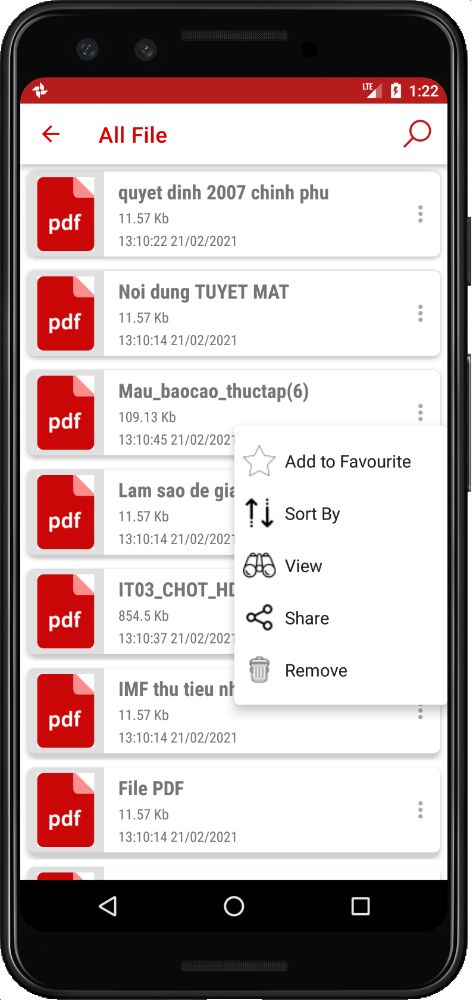
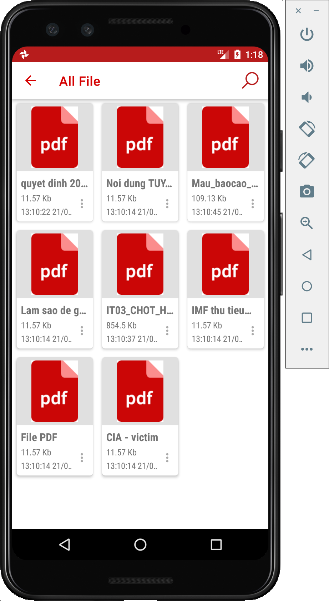
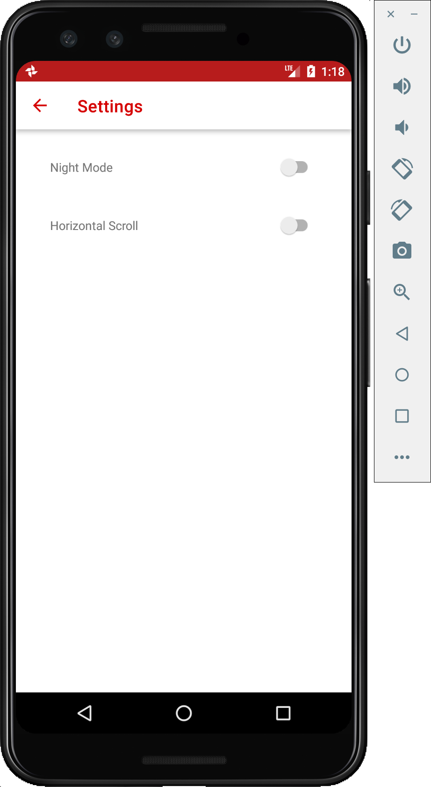
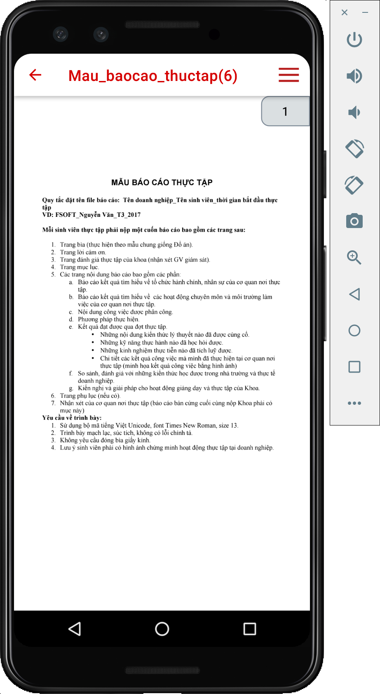
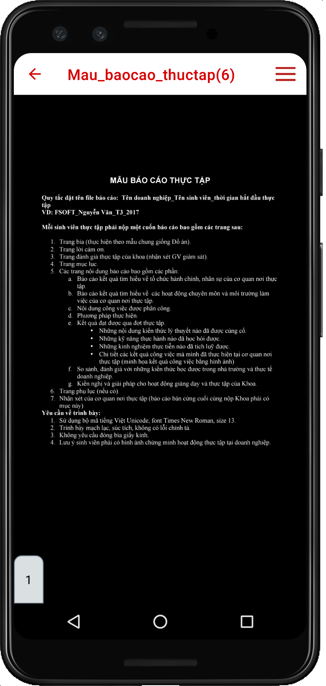

# PDF Reader

Pdf file management application

## Features 
* Read pdf files
* Customizable UI
* Share, bookmark, last read file,
* Light mode and Dark mode

## Libraries 
* [Android PdfViewer](https://github.com/barteksc/AndroidPdfViewer)
* [CrashReporter](https://github.com/MindorksOpenSource/CrashReporter)
* [SDP](https://github.com/intuit/sdp)

## Screen Shot
|  |  |  |
| - | - | - |
|  |  |  |

## Support
* Android 4.2 +

## Development team
* [Phuc Tran Ba](https://github.com/phuctranba)

## Development purpose
Personal customers
